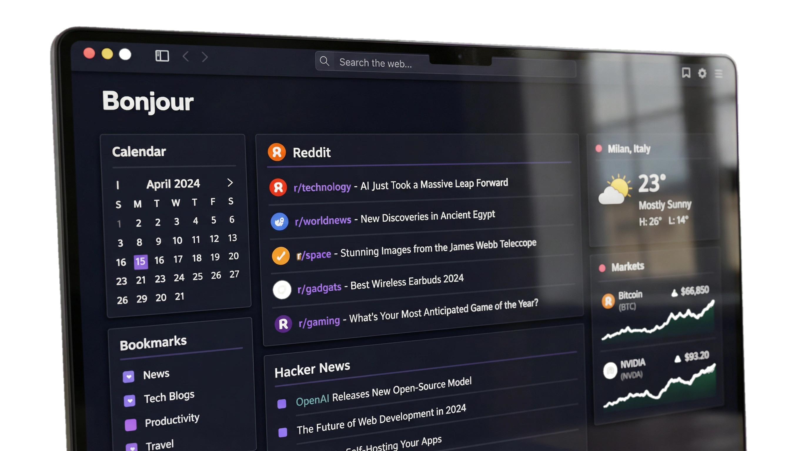
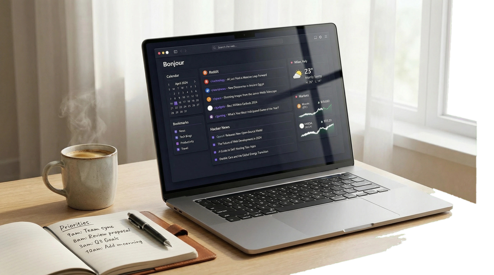
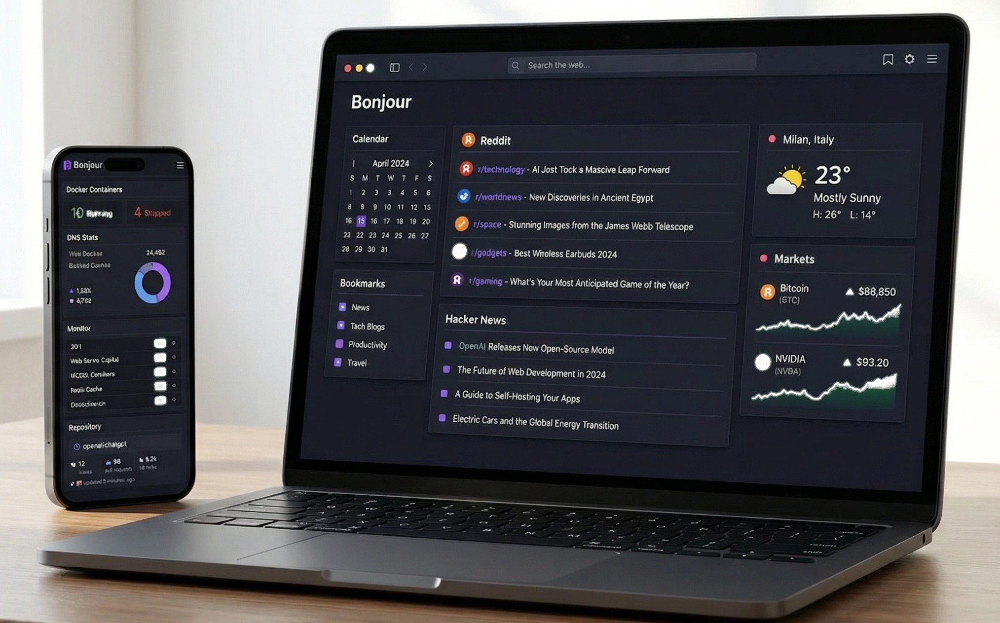
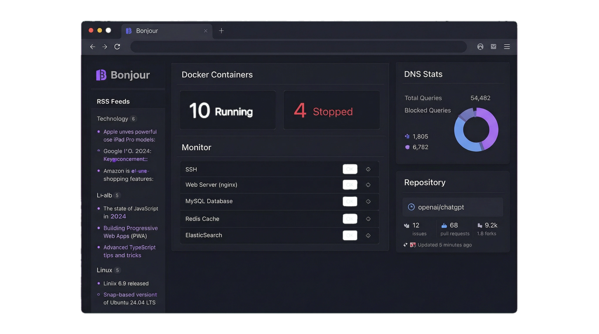

# 🖥️ Bonjour. A self-hosted dashboard that puts your feeds, data, and tools in one place.

<div align="center">
  
[](https://dishine.it/)

***Transform. Automate. Shine!***

[](https://dishine.it/)
[](https://linkedin.com/company/100682596)
[](https://go.dev/)
[](https://www.gnu.org/licenses/agpl-3.0)


<p align="center">
  
</p>

*Bonjour is a self-hosted dashboard you configure with a single YAML file and run as one Go binary (under 20 MB). It aggregates the things you check every day (RSS feeds, Reddit, Hacker News, weather, stock and crypto prices, YouTube channels, server uptime, Docker container status) into a single page you control.*

<p align="center">
  
  
</p>

***There is no database, no JavaScript framework, no build pipeline. You write a `bonjour.yml`, run the binary or a Docker container, and open your browser. The dashboard is responsive and works on desktop and mobile.***

Built by [diShine Digital Agency](https://dishine.it).

</div>

<p align="center">
  
</p>

---

## Features

| Feature | Description |
|---------|-------------|
| **RSS & news** | Hacker News, Lobsters, Reddit, custom RSS/Atom feeds |
| **Markets** | Real-time stock, crypto, and forex tracking |
| **Weather** | Multi-location weather with hourly forecasts |
| **Calendar** | Monthly calendar with customisable first day |
| **Bookmarks** | Grouped links with automatic favicons |
| **Search** | Google, DuckDuckGo, Startpage, Bing, or a custom engine |
| **Docker** | Container status monitoring |
| **Server stats** | CPU, memory, and disk usage |
| **Videos** | YouTube channel feeds |
| **Twitch** | Live streams and top games |
| **Monitor** | Uptime checks for your services |
| **Auto-refresh** | Optional periodic content refresh |
| **Themes** | Built-in theme picker with custom presets |
| **Authentication** | Password-protected dashboards (bcrypt) |
| **Responsive** | Mobile-first layout that scales to desktop |

---

## Quick start

For a complete walkthrough — including installation and your first dashboard — read the [User Guide](GUIDE.md). It is written for non-technical users.

### Docker (recommended)

```bash
# Create your config file
mkdir -p ~/bonjour && cp docs/bonjour.yml ~/bonjour/bonjour.yml

# Run with Docker
docker run -d \
  --name bonjour \
  -p 8080:8080 \
  -v ~/bonjour/bonjour.yml:/app/config/bonjour.yml \
  ghcr.io/dishine-digital-agency/bonjour:latest
```

Open http://localhost:8080

### Binary

```bash
# Download the latest release for your platform
# https://github.com/diShine-digital-agency/bonjour/releases

# Run with default config
./bonjour

# Or specify a config file
./bonjour --config /path/to/bonjour.yml
```

### Build from source

```bash
git clone https://github.com/diShine-digital-agency/bonjour.git
cd bonjour
go build -o bonjour .
./bonjour --config docs/bonjour.yml
```

---

## YAML configuration

Bonjour is entirely configured through a single `bonjour.yml` file. Here's a minimal example:

```yaml
branding:
  logo-text: Bonjour
  app-name: Bonjour

document:
  auto-refresh-minutes: 5

pages:
  - name: Dashboard
    columns:
      - size: small
        widgets:
          - type: search
            search-engine: google
            autofocus: true

          - type: calendar

          - type: weather
            location: Milan, Italy
            units: metric

      - size: full
        widgets:
          - type: rss
            feeds:
              - url: https://news.ycombinator.com/rss
                title: Hacker News

      - size: small
        widgets:
          - type: markets
            markets:
              - symbol: BTC-USD
                name: Bitcoin
```

For the full configuration reference, see [docs/configuration.md](docs/configuration.md).

---

## Installation

### Docker Compose

```yaml
services:
  bonjour:
    image: ghcr.io/dishine-digital-agency/bonjour:latest
    container_name: bonjour
    restart: unless-stopped
    ports:
      - "8080:8080"
    volumes:
      - ./bonjour.yml:/app/config/bonjour.yml
```

### Systemd service

```ini
[Unit]
Description=Bonjour Dashboard
After=network.target

[Service]
Type=simple
User=bonjour
ExecStart=/usr/local/bin/bonjour --config /etc/bonjour/bonjour.yml
Restart=always

[Install]
WantedBy=multi-user.target
```

---

## CLI commands

```bash
bonjour                           # Start the server
bonjour --config FILE             # Start with a specific config file
bonjour --version                 # Print the version
bonjour config:validate           # Validate the config file
bonjour config:print              # Print the parsed config (with includes)
bonjour secret:make               # Generate an auth secret key
bonjour password:hash <password>  # Hash a password for auth config
bonjour sensors:print             # List available hardware sensors
bonjour mountpoint:info <path>    # Print details about a mountpoint
bonjour diagnose                  # Run diagnostic checks
```

---

## Documentation

| Document | Description |
|----------|-------------|
| [User Guide](GUIDE.md) | Non-technical guide to setting up your dashboard |
| [Configuration](docs/configuration.md) | Full YAML configuration reference |
| [Themes](docs/themes.md) | Theme customization and presets |
| [Extensions](docs/extensions.md) | Custom widgets and extensions |
| [Custom API](docs/custom-api.md) | Custom API widget documentation |
| [Changelog](CHANGELOG.md) | Version history |
| [Contributing](CONTRIBUTING.md) | How to contribute |
| [Security](SECURITY.md) | Security policy |

---

## Design system

Bonjour ships with the diShine palette as the default theme:

| Colour | Hex | Usage |
|--------|-----|-------|
| Deep purple | `#6C5CE7` | Primary, accent links |
| Teal | `#00CEC9` | Positive indicators |
| Dark | `#2D3436` | Background base |

Typography: **Inter** (variable) for UI, **JetBrains Mono** for code and tabular data. Both are fully overridable through `theme:` and `branding:` keys — see [docs/themes.md](docs/themes.md).

---

## Credits

Bonjour is a fork of [Glance](https://github.com/glanceapp/glance) by [Svilen Markov](https://github.com/svilenmarkov), with a refreshed brand, additional defaults, and the diShine design system. The original project is licensed under AGPL-3.0 and so is this fork.

---

## License

GNU Affero General Public License v3.0 — see [LICENSE](LICENSE).

Copyright © 2026 [diShine Digital Agency](https://dishine.it).

---

## About diShine

[diShine](https://dishine.it) is a creative tech agency based in Milan. We design brand strategies, build digital products, advise on AI and MarTech architecture, and open-source the tools we wish already existed.

- Web: [dishine.it](https://dishine.it)
- GitHub: [github.com/diShine-digital-agency](https://github.com/diShine-digital-agency)
- Contact: [kevin@dishine.it](mailto:kevin@dishine.it)

